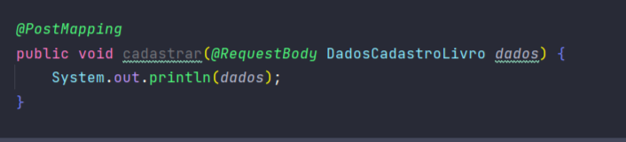

<h1>API Livraria Tec</h1>

  

Estou construindo esse projeto depois de concluir a Formação Java e Spring Boot da Alura. Meu objetivo é aplicar tudo o que aprendi. Mas, do que se trata essa aplicação? 
A API foi feita para servir uma livraria e permite o gerenciamento das suas atividades

<h2>&#x1F528 Funcionalidades do projeto</h2>

<ul>
  <li>Cadastro de livros</li>
  <li>Listagem de livros</li>
  <li>Atualização de status dos livros</li>
  <li>Exclusão dos livros</li>
</ul>

<h2>&#x2705 Técnicas e tecnologias utilizadas</h2>

<ul>
  <li><i>Java 17</i></li>
  <li><i>Spring Initializr</i></li>
  <li><i>Spring Boot</i></li>
  <li><i>Spring Boot DevTools</i></li>
  <li><i>Lombok</i></li>
  <li><i>Spring Web</i></li>
  <li><i>Insomnia</i></li>
</ul>

<h2>&#x1F477;&#x1F3FE; Construção do projeto passo a passo</h2>

<h3>1 - CRUD da API RESTful</h3>

<h4>1.1 - Cadastro</h4>

O primeiro passo depois da configuração inicial foi implementar um sistema de cadastro de livros na API. Optei por usar o padrão DTO para representar os dados que chegam na API já que quero filtrar quais dados serão transmitidos. Fiz uso dos Records para setar os campos que desejo receber.

  
  
Ainda não estamos trabalhando com banco de dados. Mas logo logo iremos fazê-lo :)

<h2>&#x1F4C1 Acesso ao projeto</h2>

Você pode <a href="https://github.com/Yam-BS/api-livraria-tec/tree/master/src">acessar o código-fonte do projeto</a> ou <a href="https://github.com/Yam-BS/api-livraria-tec/archive/refs/heads/master.zip">baixá-lo</a>

